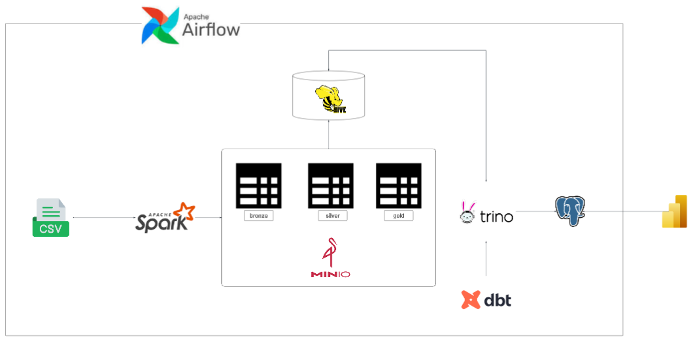
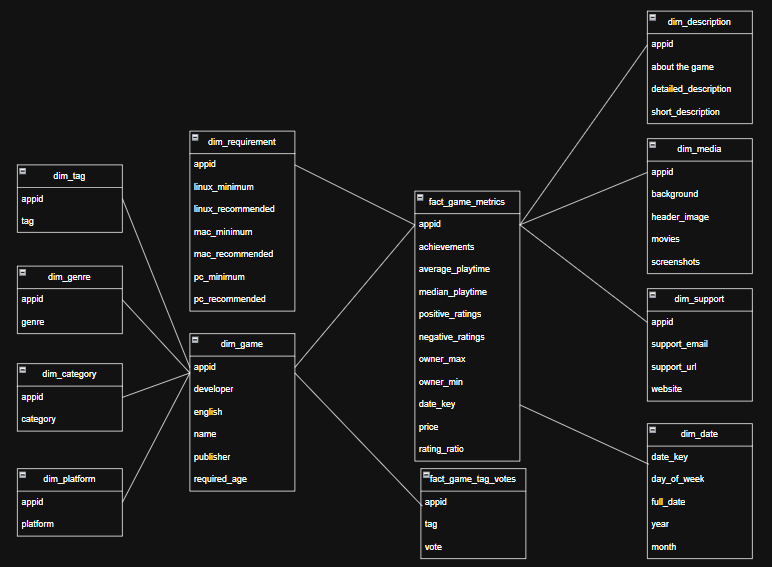
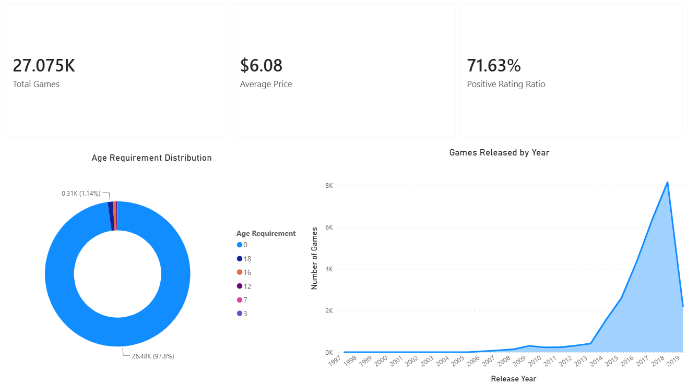
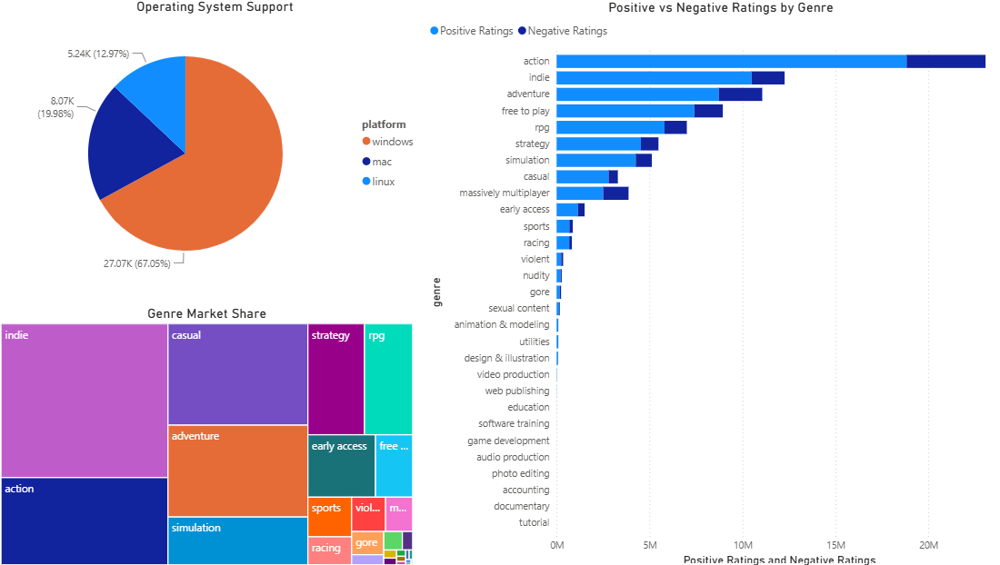
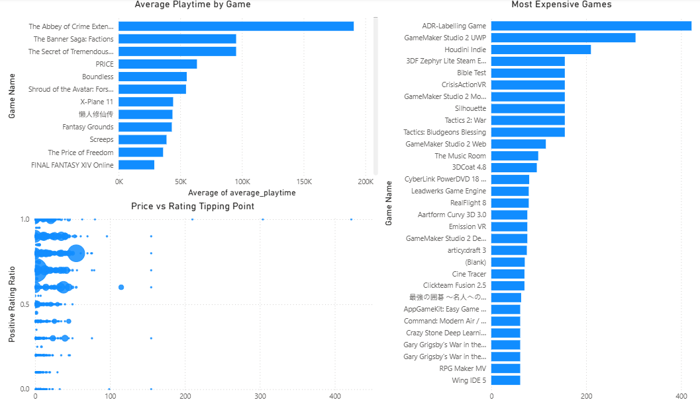

# Steam-Store-Games

>*As a gamer and data enthusiast, I have always been fascinated by how the Steam marketplace evolves. This curiosity inspired me to explore the data behind the platform and gain deeper insights into market trends, player preferences.*

## Table of Contents

- [Overview](#overview)
- [Architecture](#architecture)
- [Data Quality](#data-quality)
- [Data Visualization](#data-visualization)
- [Data Source](#data-source)
- [Project Structure](#project-structure)

## Overview

This project is designed to collect, store, process, and visualize data from the Steam Store for game market analysis. The goal is to derive meaningful insights into market trends and game performance.

## Architecture



The model brings together the different information available for each game, keeping related data organized and connected so it is easier to understand each game and its overall characteristics.



## Data Quality

### 1.Completeness

#### `steam`

| Column | Null Count | STATUS |
| ------ | ---------- | ------ |
| appid | 0 | PASS |
| name | 0 | PASS |
| release_date | 0 | PASS |
| english | 0 | PASS |
| developer | 0 | PASS |
| publisher | 0 | PASS |
| platforms | 0 | PASS |
| required_age | 0 | PASS |
| categories | 0 | PASS |
| genres | 0 | PASS |
| steamspy_tags | 0 | PASS |
| achievements | 0 | PASS |
| positive_ratings | 0 | PASS |
| negative_ratings | 0 | PASS |
| average_playtime | 0 | PASS |
| median_playtime | 0 | PASS |
| owners | 0 | PASS |
| price | 0 | PASS |

#### `steam_description_data`

| Column | Null Count | STATUS |
| ------ | ---------- | ------ |
| steam_appid | 0 | PASS |
| detailed_description | 0 | PASS |
| about_the_game | 0 | PASS |
| short_description | 0 | PASS |

#### `steam_media_data`

| Column | Null Count | STATUS |
| ------ | ---------- | ------ |
| steam_appid | 0 | PASS |
| header_image | 0 | PASS |
| screenshots | 0 | PASS |
| background | 0 | PASS |
| movies | 1,691 | PASS |

#### `steam_requirements_data`

| Column | Null Count | STATUS |
| ------ | ---------- | ------ |
| steam_appid | 0 | PASS |
| pc_requirements | 0 | PASS |
| mac_requirements | 0 | PASS |
| linux_requirements | 0 | PASS |
| minimum | 5 | PASS |
| recommended | 13,185 | PASS |

#### `steam_support_info`

| Column | Null Count | STATUS |
| ------ | ---------- | ------ |
| steam_appid | 0 | PASS |
| website | 9,121 | PASS |
| support_url | 10,654 | PASS |
| support_email | 3,634 | PASS |

#### `steamspy_tag_data`

| Column | Null Count | STATUS |
| ------ | ---------- | ------ |
| appid | 0 | PASS | PASS |
| Tag columns | 0/371 | PASS |

### 2.Timeliness

| Check | Condition | Result | Status |
| ----- | --------- | ------ | ------ |
| Release date | `release_date > current_date` | 0 | PASS |

### 3.Validity

| Column | Condition | Result | Status |
| ----- | --------- | ------ | ------ |
| appid | `appid <= 0` | 0 | PASS |
| required_age | `required_age < 0 ` | 0 | PASS |
| english | `english not in (0, 1)` | 0 | PASS |
| platforms | `platforms not in ["windows", "mac", "linux"]` | 0 | PASS |
| price | `price < 0` | 0 | PASS |
| positive_ratings | `positive_ratings < 0` | 0 | PASS |
| negative_ratings | `negative_ratings < 0` | 0 | PASS |
| average_playtime | `average_playtime < 0` | 0 | PASS |
| median_playtime | `median_playtime < 0` | 0 | PASS |
| achievements | `achievements < 0` | 0 | PASS |
| release_date | Not in valid date format (yyyy-MM-dd) | 0 | PASS |
| header_image | Not in valid URL format https | 0 | PASS |

### 4.Integrity

| Check | Result | Status |
| ----- | ------ | ------ |
| Steam -> Steam_description_data | 0 | PASS |
| Steam -> Steam_media_data | 0 | PASS |
| Steam -> Steam_requirements_data | 13 | FAIL |
| Steam -> Steam_support_info | 194 | FAIL |
| Steam -> Steamspy_tag_data | 0 | PASS |

### 5.Uniqueness

| Table | Column | Check Type | Result | Status |
| ----- | ------ | ---------- | ------ | ------ |
| steam | appid | Duplicate | 0 | PASS |
| steam_description_data | steam_appid | Duplicate | 0 | PASS |
| steam_media_data | steam_appid | Duplicate | 0 | PASS |
| steam_requirements_data | steam_appid | Duplicate | 0 | PASS |
| steam_support_info | steam_appid | Duplicate | 0 | PASS |
| steamspy_tag_data | appid | Duplicate | 0 | PASS |

## Data Visualization

### 1. Market Overview

This dashboard provides a high-level summary of the Steam marketplace by monitoring three core metrics: Total Games, Average Price, and Positive Rating Ratio. It visualizes the Age Requirement Distribution of the catalog alongside the volume of Games Released by Year, allowing users to immediately understand the market's composition and release trends.



### 2. Product Performance

This dashboard breaks down game performance across categories and platforms. It features a treemap showcasing Genre Market Share and a pie chart analyzing Operating System Support. Additionally, a stacked bar chart compares Positive vs Negative Ratings by Genre, making it easy to contrast user sentiment against specific game types.



### 3. Commercial Insights

This dashboard examines the intersection of pricing strategy, player engagement, and market value. It uses a scatter plot to analyze the Price vs Rating Tipping Point, mapping out how price levels correlate with positive user feedback. Additionally, two horizontal bar charts rank the market's outliers by displaying the Average Playtime by Game alongside the Most Expensive Games, offering a clear view of commercial factors on Steam.



## Data Source

The dataset used in this project is2q332 publicly available on Kaggle under the title [Steam Store Games](https://www.kaggle.com/datasets/nikdavis/steam-store-games). It contains information on over 27,000 Steam games from 1997 to 2019, including metadata, pricing, genres, system requirements, ratings, and playtime statistics.

## Project Structure

```
steam-store-games/
├── analytics_core/
│   ├── dbt_project.yml
│   └── models/
├── config/
├── data/
├── dags/
│   ├── configs/
│   └── root/
├── plugins/
│   ├── generators/
│   └── models/
└── src/
    ├── catalog/
    ├── config/
    ├── ingestion/
    ├── transform/
    └── utils/
```